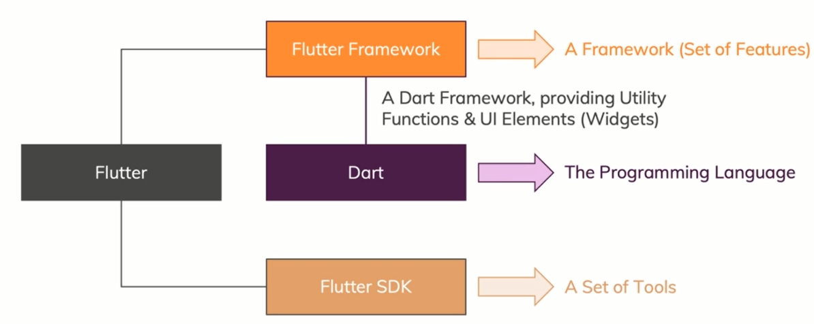

# What is Flutter?

A "**tool**" that allows you to build **native cross-platform** (iOS, Android) app with **one programming language** and **codebase**.

The term **Flutter** refers to two major things.

1. SDK (Software Development Kit )

* You could say collection of tools that allows you to write one code base or use one codebase with one programing language.
* Because it includes tools to then compile this code, which normally would not run on iOS and Android, into native machine code that run on these platforms
* Therefore,Flutter does not work on iOS and Android, so its need to be compiled to native machine code for iOS and native machine code for Android

1. Framework/Widget Library

* It gives you vast collection of reusable UI building blocks, these so called **Widget**, so these are like buttons, tabs, text inputs, drop downs etc. You get all of that out of the box.
* You can style and customize them and and then you build user interfaces with these tools.
* In addition, you get a couple of utility functions and generally some packages that help you build what you user see and what your user interact.

## Dart

Flutter uses a programming language called Dart, Dart is a programming language which is focused on building front-end user interfaces, front-end apps.

It is not limited to building mobile apps, but you can also build web apps with Dart. So it is a programming language built to make it really simple to build front-end user interfaces.

It is a programming language which was build by Google. It is an Object-oriented and strongly typed language and its syntax is a bit like a mixture of JavaScript, Java, C# (you don't need to know these languages!).

## Flutter vs Dart

Flutter builds up on Dart, it's a framework for Dart and Dart actually is the programming language which we are using, Flutter is just a collection of tools, a set of features, utility functions and these widgets which are implemented using Dart.

