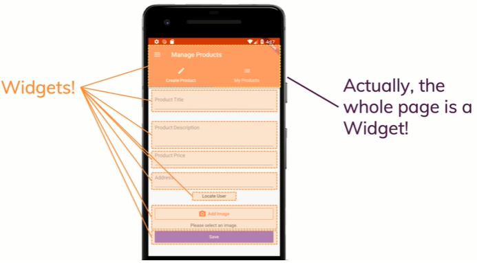

# Flutter Architectures

## Everything is a Widget

In flutter everything is a **Widget**, that is important to understand. If you had an app that looks like this, then this is a bunch of widgets.

For example, the app bar at the top with the tabs in there, that's one huge widget with a lot of smaller widgets in there and all these elements on the screen are just widgets in the end,you build your entire screen, your entire app from such widgets.
Actually the whole page is a widget, and even the whole app is wrapped in one main widget.

## App's UI s a Widget Tree

Your entire app is therefore built as a Widget Tree.
You have a:

* Root Widget (which is your app itself)
* Then you might have different screens.
* On different screen, you have different sections.
* On different sections you might have:
  * text inputs
  * buttons
  * tabs
  * drop down
  * and a widget holding other widgets

## UI as Code

You had a application that is look like this, that you don't build it by using visual drag and drop editor for adding buttons or text inputs to your screen, instead you only work in code.

**Note:** Flutter apps do actually embraces platform differences, while being based on one code base. So we will work in one project but we still have the ability to create different user interfaces at some points or some parts of our app if we need it for different platforms because Android and iOS are not exactly the same.
Flutter gives you the tools to find out on which platform you are running the app, so that if you are on Android, you can execute **code A**, and if you are on iOS, you can execute code B.
